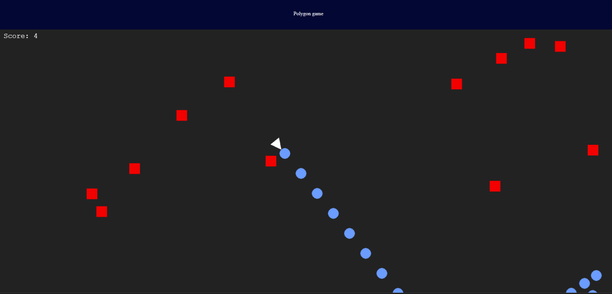

# Polygon Game

You are now a triangle. You can shoot circles at squares. You can move to dodge the squares, but if they touch you, the game is over. A square spawns every two fifts of a second and you can shoot once every fifth of a second.

## Movement
You can move using the arrow keys, and change where you are aiming by moving your mouse.